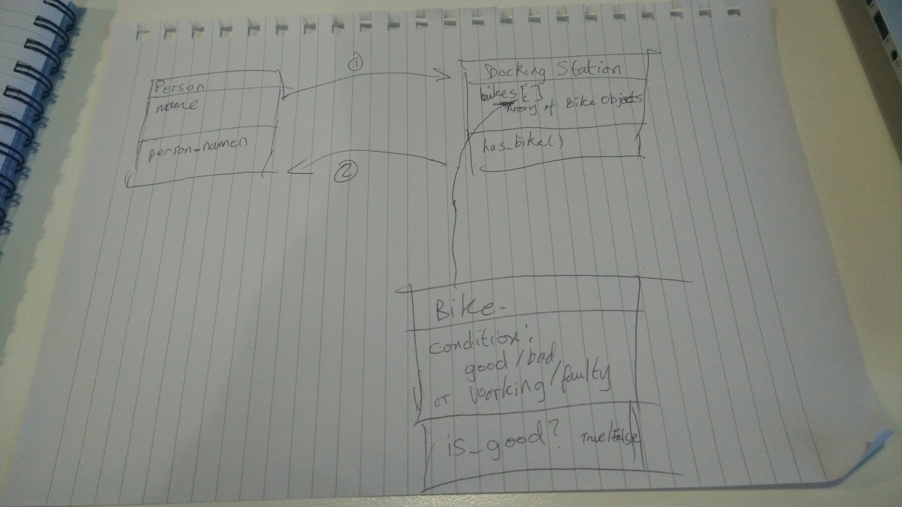

# Challenge 2: Working with User Stories

**User stories:**

As a person,
So that I can use a bike,
I'd like a docking station to release a bike.

As a person,
So that I can use a good bike,
I'd like to see if a bike is working

<table>
<tr><td>**Objects**</td><td>**Messages**</td>
<tr><td>Person</td><td>person_name</td></tr></tr>
<tr><td>Bike</td><td>is_good</td></tr></tr>
<tr><td>Docking Station</td><td>has_bike</td></tr></tr>
</table>

**Assumptions**
* It's not explicit in the user stories, but we assume it would be useful to tell Persons apart from each other, so let there be a `person_name` method.
* A working bike == A good bike; Let `is_good` cover this

**Object Diagram**

